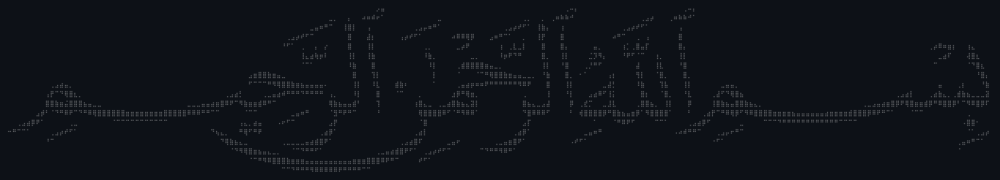

<h3> Assalamu alaikum السلام عليكم</h2>

#

#
<!--

-->
<h3>AI and Data Science Student</h3>

<ul> 
<li>Undergradute student with solid understanding of key math and computer science concepts, including linear algebra, calculus, and probability.</li>
<li>Familiar with data structures like arrays, linked lists, stacks, queues, trees and graphs.</li>
<li>Proficient in in Python for data science and essential machine learning algorithms such as linear regression, logistic regression, decision trees, KNN, naive bayes and Support vector machine (SVM).</li>
<li>Completed training in IoT, where I learned about C language, ESP32, and the MQTT protocol. Applied these skills to create <a href="https://github.com/ahmadmourad/Smart-Cooling-System-IoT-Final-Project">Smart Cooling System</a>.</li>
<li>Knowledgeable in clustering techniques like K‑means, K‑medoids and hierarchical clustering.</li>
<li>Basic understanding of Databases, cloud computing and neural networks.</li>
<li>Basic skills in Java, MySQL and Docker. </li>
<!--<li>🌱 I’m currently learning <strong>Web dev, Data Science, Machine Learning, AI.</strong></li>-->
<li><strong>🌱 Eager to learn more and take on any opportunity to grow and apply my
skills in real‑world projects.</strong> </li>
</ul>

<!-- 

 -->

#

<h3 align="left">Used Tools and Programming Languages:</h3>
<table>
  <tr>
    <td align="center" width="100px">
      
       Linux
    </td>
    <td align="center" width="100px">
      
       Git
    </td>
    <td align="center" width="100px">
      
       Docker
    </td>
<!--     <td align="center" width="100px">
      
       C
    </td> -->
    <td align="center" width="100px">
      
       C++
    </td>
    <td align="center" width="100px">
      
       Arduino
    </td>
    <td align="center" width="100px">
      
       Java
    </td>
      <td align="center" width="100px">
      
       MySQL
    </td>
    <td align="center" width="100px">
      
       HTML
    </td>
<!--     <td align="center" width="100px">
      
       CSS
    </td> -->
  </tr>
  <tr>
<!--     <td align="center" width="100px">
      
       JavaScript
    </td> -->
<!--     <td align="center" width="100px">
      
       React
    </td> -->
    <td align="center" width="100px">
      
       Python
    </td>
    <td align="center" width="100px">
      
       Pandas
    </td>
    <td align="center" width="100px">
      
       NumPy
    </td>
    <td align="center" width="100px">
      
       Scikit-learn
    </td>
    <td align="center" width="100px">
      
       Matplotlib
    </td>
    <td align="center" width="100px">
      
       Seaborn
    </td>
        <td align="center" width="100px">
      
       TensorFlow
    </td>
    <td align="center" width="100px">
      
       PyTorch
    </td>
  </tr>
<!--   <tr>
  </tr> -->
</table>

<!-- 

  <!-- First Row: Most Used Languages and GitHub Stats --
  

    

  

  
  <!-- Second Row: Contributions and Streak --
  

    
    
    
  

-->

#

### 📫 &nbsp; How to reach me:
 &nbsp;
 &nbsp;
 &nbsp;
 &nbsp;
